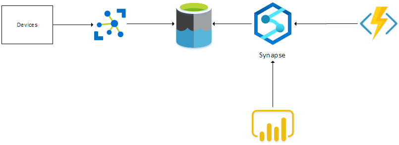
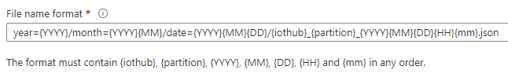
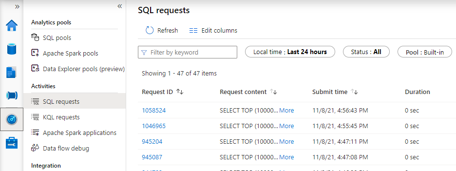

When we want to collect and analyze device-telemetry information, we typically look at solutions like Azure Timeseries Insights, Azure Data Explorer, InfluxDb, ...
But, what if you actually do not need all the functionality that those services provide ?  What if you just want to be able to query the telemetry data and visualize that data in a PowerBI report ?  Aren't there any cheaper alternatives to achieve this ? It turns out, Azure Synapse make this possible using serverless SQL pools.

## What is Azure Synapse

Azure Synapse is a data analytics service that allows you -among others things- to query data that resides in various datasources via plain SQL statements.

For instance, you can query data that is stored in an Azure Data Lake Gen2 via Azure Synapse using SQL statements, and that's what we'll do in this article. 

To learn more about Azure Synapse, check out [this](https://azure.microsoft.com/en-us/services/synapse-analytics/#overview) page.  

## Architecture overview

When collecting telemetry from multiple devices, we need an IoT gateway that accepts all telemetry.  In this case, we'll be using an Azure IoT Hub.  The raw telemetry that is received from the devices, is dumped in a Data Lake.  Azure Synapse is linked to the Data Lake and this makes sure that SQL-like queries can be executed on the data that resides in the Data Lake.
An Azure Function uses this functionality to query the received raw telemetry and transform the data into a curated dataset.   A report can be built in PowerBI which uses the Synapse connector to query the curated dataset and display the results.



Let's take a closer look at the various components in the next sections.

A basic implementation of this architecture can be found in [this GitHub repository](https://github.com/fgheysels/synapse-iot-poc).

## Storing raw telemetry in the Data Lake

Storing the telemetry that is received in IoT Hub to a Data Lake is actually super simple.  This can be done by leveraging the IoT Hub Routing functionality.
Specify a route in IoT Hub that delivers the Device Telemetry messages to a Storage endpoint.  The Storage endpoint points to a Storage Account (StorageV2) that supports Hierarchical Namespaces.

It is important to think about the hierarchy or partitioning in where the messages will be stored.  In this case, we will periodically query for new messages that have been received, therefore we choose a hierarchy where we partition on enqueue-date.  So we set this 'filename-format' in the route-definition:



This means that files will be added to the data lake in a hierachy that looks like this:

```
|_ year=2021
   |_month=202110
     |_date=20211021
       |_iothubname_01_202110211043.json
       |_iothubname_01_202110211045.json
```

## Building the curated dataset

### Querying raw telemetry using Synapse

Now that the raw telemetry messages are stored in a Data Lake, there must a way to query that data.
That's where Azure Synapse comes into the picture.

Azure Synapse allows you to write SQL queries against the files that are stored in a Data Lake.  The [`OPENROWSET`](https://docs.microsoft.com/en-us/azure/synapse-analytics/sql/develop-openrowset) function is what makes this possible.  This function allows to query CSV, JSON and parquet files that are present in Azure Storage.

To make use of this, we create a database in the serverless SQL pool in Synapse.  By doing this we can create a view in that database that uses the `OPENROWSET` function to query the files that exist in the Data Lake.  The view is defined like this:

```sql
DROP VIEW IF EXISTS telemetrydata
GO
CREATE VIEW telemetrydata
AS
    SELECT *, rows.filepath(1) as [Year], rows.filepath(2) AS [Month], rows.filepath(3) AS [Date]
    FROM OPENROWSET(
        BULK 'https://<storageaccountname>.blob.core.windows.net/<containername>/year=*/month=*/date=*/*.json',
        FORMAT = 'csv',
        FIELDTERMINATOR ='0x0b',
        FIELDQUOTE = '0x0b'
    ) WITH (doc nvarchar(max)) AS rows
```

Having this view allows you to write simpler queries.  Notice the usage of the `filepath` function in the `SELECT` clause.  These columns allow us to perform [folder partition elimination when filtering on these columns](https://docs.microsoft.com/en-us/azure/synapse-analytics/sql/create-use-views#partitioned-views).  By doing that, the query needs to inspect less files to produce the resultset which means that this can improve performance.

### Building parquet files

An Azure Function which is triggered by a timer, queries the view that we have defined in Synapse to retrieve the telemetry-data that has been received since the function's last run.  
The function will build a parquet dataset and stores that dataset in another container in the Data Lake.  I've choosen a timer-triggered Function instead of a Blob-trigger because I want to combine data from multiple input-files in one parquet file.

Be aware that the Azure Function needs to have the Storage Blob Data Contributor role assigned to be able to read and write blobs in the DataLake.

The parquet files can be partitionned in a hierarchical way.  Choose a partitioning hierarchy which is suited for the way the parquet files will be queried.

## Reporting via PowerBI

Use PowerBI Desktop to create some simple reports on the curated Parquet dataset.

To achieve this, you must create a `DirectQuery` dataset to a `SQL Server` datasource.  
The dataset points to the Serverless SQL endpoint of Azure Synapse.  This will allow PowerBI to issue SQL statements against the Serverless SQL pool in Synapse.

The SQL statements that are generated by your PowerBI reports can be viewed via the `Monitor` blade in your Azure Synapse Workspace studio:



## Wrapping up

This article shows how easy it can be to query data that is stored in a Data Lake using SQL commands via Azure Synapse and how you can make use of hierarchies to partition the data to improve query performance.

While this is certainly not a replacement for services like Azure Data Explorer, Azure Timeseries Insights, InfluxDb, ... in terms of performance and features, it allows you to build reports to get insights into your data.

Thanks for reading,
Frederik