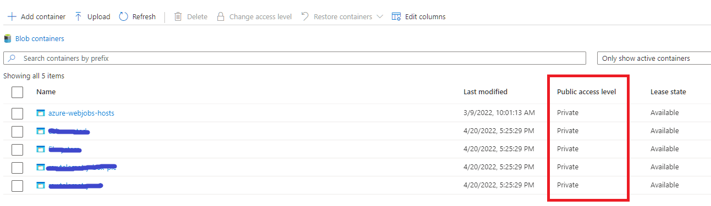

Querying data in an Azure Data Lake is quite easy with Azure Synapse as explained [here](./2021-11-24-querying-datalake-with-synapse.md).
However, when the data that is stored in your Data Lake is not publicly available to everybody (in most cases, you don't want to have your data exposed to anonymous users), there are some things that you need to consider.
In this blog, I'll try to go over those specificalities.

## Do not expose your data to anonymous users

First of all, you want to make sure that your data is not available to anonymous users.
Therefore, you should set the `Public access level` of the blob-containers in your Azure Storage Account to `Private`.



## How can Azure AD users query the data that is in private storage ?

Allowing Azure AD users to query files in your DataLake via Synapse is fairly easy.

You need to make sure that those users have the `Synapse SQL Administrator` role assigned.  They'll then be able to connect to the (serverless) SQL endpoint of Synapse.

Additionally, assign them the `Storage Blob Data Contributor` role on the Data Lake, so that it is possible to actually read the data as well.

In practice, you can create an Azure AD group and add all the users that are allowed to read data in your Data Lake to that group.

By executing the following commands, the required access rights will be set:

- Creating a role-assignment that adds the group to the `Storage Blob Data Contributor` role on the Data Lake.  You can either do this via Azure CLI:

  ```bash
  az role assignment create `
     --role "Storage Blob Data Contributor" `
     --assignee-object-id <object id of Azure AD Group> `
     --assignee-principal-type Group `
     --scope <resource_id_of_datalake>
  ```

  or, via a bicep template:

  ```bicep
  // datalake is the mnemonic of the DataLake resource that is also defined in this bicep template

  var az_ad_group_object_id = '<object id of Azure AD Group>'
  var storageBlobDataContributorRoleID = 'ba92f5b4-2d11-453d-a403-e96b0029c9fe'

  resource datalake_roleassignment_adgroup 'Microsoft.Authorization/roleAssignments@2021-04-01-preview' = {
    name: guid(datalake.id, az_ad_group_object_id, storageBlobDataContributorRoleID)
    scope: datalake
    properties: {      
      principalId: az_ad_group_object_id
      principalType: 'Group'
      roleDefinitionId: resourceId('Microsoft.Authorization/roleDefinitions', storageBlobDataContributorRoleID)
    }
  }
  ```

- Creating a role-assignment in Synapse to add the group to the `Synapse SQL Administrator` role:

  ```bash
  az synapse role assignment create --workspace-name $(Synapse.Name) --role "Synapse SQL Administrator" --assignee-object-id $(object_id_of_group) --assignee-principal-type Group
  ```

  >⚠️Note that I'm using the `az synapse role assignment create` command that is taking the `--assignee-object-id` parameter in conjunction with the `--assignee-principal-type` parameter instead of the more straightforward approach where you just specify the `--assignee` as shown in the examples [here](https://docs.microsoft.com/en-us/cli/azure/synapse/role/assignment?view=azure-cli-latest#az-synapse-role-assignment-create-examples).  The reason for this is a bug I've found and reported [here](https://github.com/Azure/azure-cli/issues/22078).

Once these steps have been executed, the users that are defined in that Azure AD group should have the necessary rights to connect to the SQL endpoint in Synapse and query the data.

## How can SQL users query the data that is in private storage ?

When you have a situation where you need to use SQL accounts to connect to your SQL endpoint in Synapse, you can do two things:

- Use SAS tokens to connect to Synapse
- Create a credential that impersonates Synapse's managed identity to query the Data Lake.

I will not cover connecting using SAS tokens in this article, instead I want to focus more on the latter option.

To be able to query the Data Lake via the Synapse Serverless SQL endpoint using a SQL account, follow these steps:

### Role Assignment on the Data Lake for Azure Synapse

Azure Synapse must be able to access the blobs that are present in the Data Lake.  This can be done via Azure CLI or via bicep:

```bash
  az role assignment create `
     --role "Storage Blob Data Contributor" `
     --assignee-object-id <object id of Synapse> `
     --assignee-principal-type ServicePrincipal `
     --scope <resource_id_of_datalake>
  ```

  or, via a bicep template:

  ```bicep
  // datalake is the mnemonic of the DataLake resource 
  // that is also defined in this bicep template

  // synapse is the mnemonic of Azure Synapse resource 
  // that is also defined in this bicep template

  var storageBlobDataContributorRoleID = 'ba92f5b4-2d11-453d-a403-e96b0029c9fe'

  resource datalake_roleassignment_adgroup 'Microsoft.Authorization/roleAssignments@2021-04-01-preview' = {
    name: guid(datalake.id, synapse.id, storageBlobDataContributorRoleID)
    scope: datalake
    properties: {      
      principalId: synapse.identity.principalId
      principalType: 'ServicePrincipal'
      roleDefinitionId: resourceId('Microsoft.Authorization/roleDefinitions', storageBlobDataContributorRoleID)
    }
  }
  ```

### Create the SQL login

When you want to connect to a SQL Server endpoint using a SQL account that impersonates Synapse's identity, you must of course start with setting up the login.

This is done by executing these T-SQL commands on the `master` database:

```sql
IF NOT EXISTS ( SELECT * FROM sys.server_principals WHERE [name] = 'my_sql_username' )
BEGIN
    CREATE LOGIN [my_sql_username] WITH PASSWORD = 'some_strong_password'    
END
```

### Create a server-scoped credential for accessing the files in the Data Lake

Define a server-scoped credential for the container in the Data Lake that contains the files that you want to query, and specify that Synapse should connect to the Data Lake using it's own managed identity:

```sql
IF NOT EXISTS (SELECT * FROM sys.credentials WHERE name = 'https://<storage account name>.blob.core.windows.net/<container_name>)
BEGIN
    CREATE CREDENTIAL [https://<storage account name>.blob.core.windows.net/<container_name>]
        WITH IDENTITY = 'Managed Identity'
END
```

> ⚠️ Note that the name of the credential must match the URL that points to the container that must be queried.
> By specifiying `Managed Identity` to the `IDENTITY` property, you specify that Synapse SQL must connect to that location using Synapse's Managed Identity.

### Create a USER in your database

With the LOGIN and CREDENTIAL created, you can connect to the Serverless SQL endpoint in Synapse, but you might need to login to a specific database that you've created in Synapse.

This means we still need to define a USER that can be used to login to that database.
This is done by executing the commands below when connected to your database (so not in the `master` database)

```sql
USE [<my_database_name>]
GO

IF NOT EXISTS ( SELECT * FROM sys.database_principals WHERE [name] = 'my_sql_username' )
BEGIN
    CREATE USER [my_sql_username] FOR LOGIN [my_sql_username]

    ALTER ROLE db_datareader ADD MEMBER [my_sql_username]    
END
```

### Test the connection

That's it!  All the steps that are required to connect to Synapse using a SQL account have been done.
Now, you should be able to connect to your database that is defined in Synapse Serverless SQL.

This can be done via SQL Server Management studio, or via the following C# code:

```csharp
using( var connection = new SqlConnection("Server=tcp:mysynapse-ondemand.sql.azuresynapse.net,1433;Database=<my_database_name>;User ID=<my_sql_username>;Password=<some_strong_password>;Trusted_Connection=False;Encrypt=True;") )
{
    connection.Open();
    Console.WriteLine("Successfully opened connection to Synapse SQL using SQL authentication");
}
```

## Query the data that's in the Data Lake

Regardless if you're using Azure AD authentication or SQL authentication to connect to the Serverless SQL endpoint in Synapse, you should now be able to query the (parquet) files that are in your Data Lake using this SQL command:

```sql
SELECT TOP 10 r.* 
FROM OPENROWSET (
    BULK = 'https://<storage account name>.blob.core.windows.net/<container name>/*.parquet',
    FORMAT = 'parquet'
) AS r

```

More information and additional options can be found in the Microsoft Document [here](https://docs.microsoft.com/en-us/azure/synapse-analytics/sql/develop-openrowset) and [here](https://docs.microsoft.com/en-us/azure/synapse-analytics/sql/develop-storage-files-overview?tabs=impersonation#query-files-using-openrowset).

Hope this helps,

Frederik